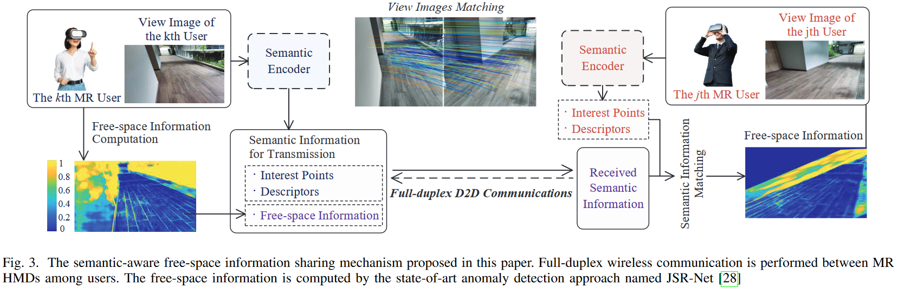
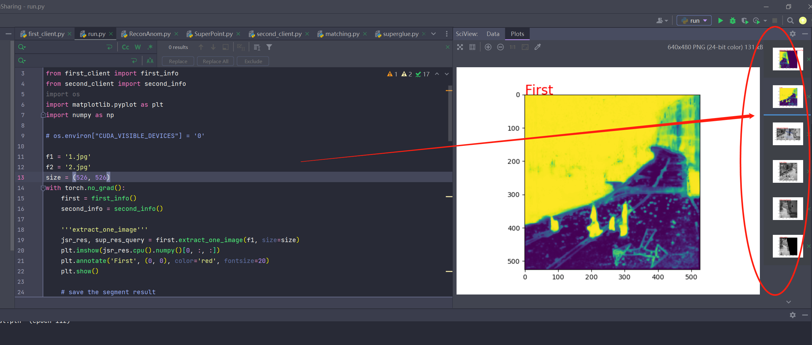
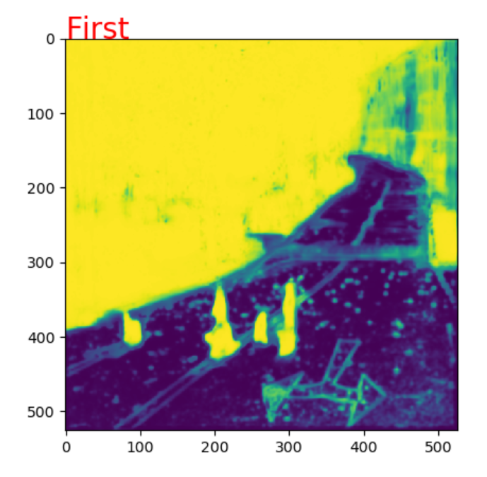
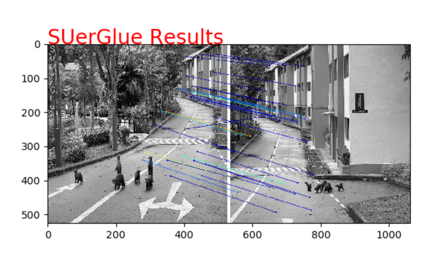
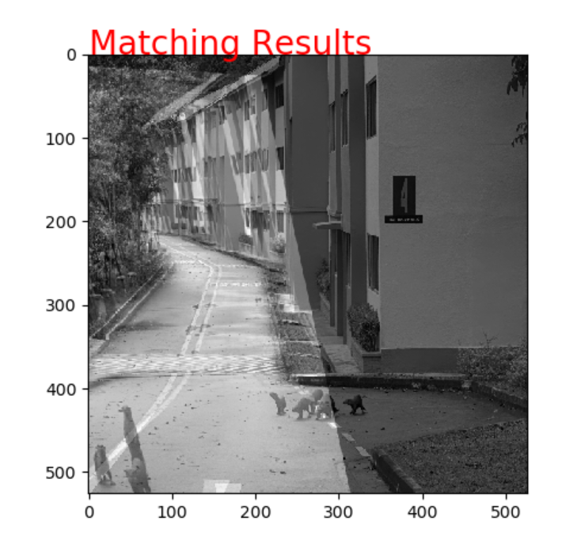
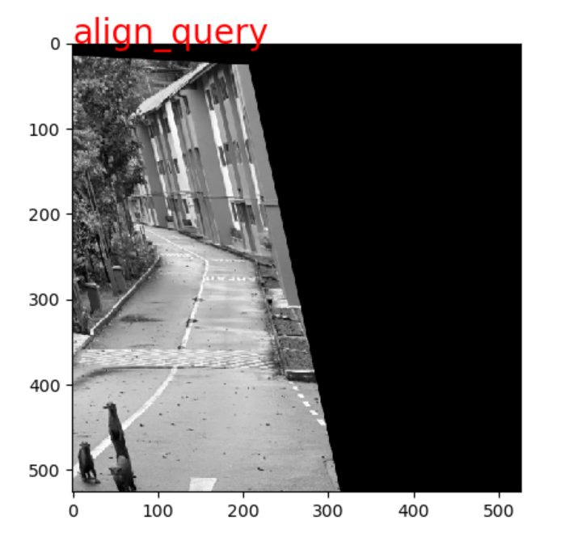
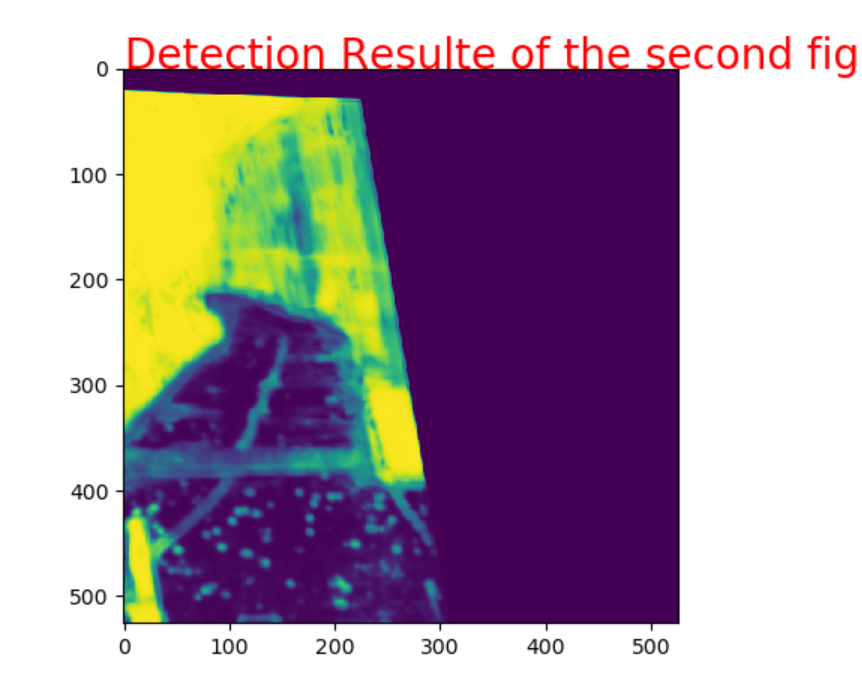

# AI-Generated Incentive Mechanism and Full-Duplex Semantic Communications for Information Sharing

This repository hosts a demonstration of the semantic encoder and decoder algorithm as presented in the paper

> **"AI-Generated Incentive Mechanism and Full-Duplex Semantic Communications for Information Sharing"**

Authored by Hongyang Du, Jiacheng Wang, Dusit Niyato, Jiawen Kang, Zehui Xiong, and Dong In Kim, accepted by IEEE JSAC.

The paper can be accessed [Here](https://ieeexplore.ieee.org/document/10158526) or [Arxiv](https://arxiv.org/abs/2303.01896).



---

## 🔧 Environment Setup

To create a new conda environment, execute the following command:

```bash
conda create --name sems python==3.7
```
## ⚡Activate Environment

Activate the created environment with:

```bash
conda activate sems
```

## 📦 Install Required Packages

The following packages can be installed using pip:

```bash
pip install matplotlib==3.1.3
pip install torch
pip install opencv-python==4.1.2.30
pip install scipy
pip install yacs
pip install torchvision
pip install scikit-image
```

## 🏃‍♀️ Run the Program

Run `run.py` to start the program.


## 🔍 Check the results

In this demo, we consider that there are two users, whose view images are:


After run the code, several results can be viewed in PyCharm:



For instance, the safe walk area calculated by the first user:



Semantic matching results of two view images:



Another way to show semantic matching results of two view images:



How the second user transforms the view image of the first user to match their own view image:



The safe walk area information that the second user obtains based on the semantic information shared by the first user:




## 📚 Cite Our Work

Should our code assist in your research, please acknowledge our work by citing:

```bibtex
@article{du2023ai,
  title={{AI}-generated incentive mechanism and full-duplex semantic communications for information sharing},
  author={Du, Hongyang and Wang, Jiacheng and Niyato, Dusit and Kang, Jiawen and Xiong, Zehui and Kim, Dong In},
  journal={IEEE Journal on Selected Areas in Communications},
  year={2023},
  publisher={IEEE}
}
```

## 📚 Acknowledgement

As we claimed in our paper, this repository used the codes in the following papers:

JSR-Net: https://github.com/vojirt/JSRNet
SuperPoint: https://github.com/rpautrat/SuperPoint
SuperGlue: https://github.com/magicleap/SuperGluePretrainedNetwork

Please consider to cite these papers if their codes are used in your research.

---

For the AI-generated incentive part in the paper, we are currently working on a comprehensive tutorial for the diffusion model-related code and will update the repository as soon as it's ready.

Please stay tuned for updates!
